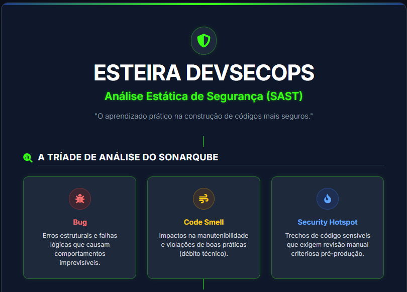
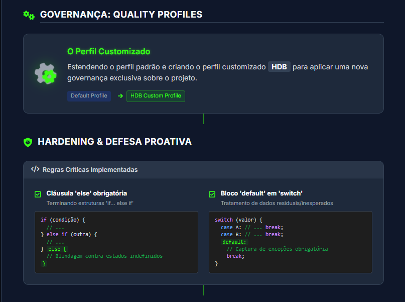
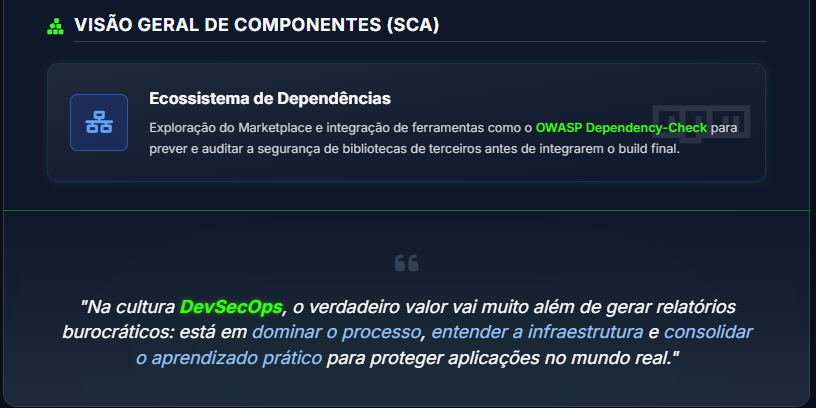

# 🔬 Lab 3.2: Segurança de Software e Análise de Vulnerabilidade

Este diretório contém o registro conceitual e o mapeamento de competências desenvolvidas durante as atividades práticas de análise estática de segurança (SAST) e gestão de conformidade de código.

---

## 📑 Objetivos Analíticos

O propósito deste laboratório foi implementar um fluxo de governança de segurança em uma aplicação desenvolvida na linguagem Go (`my-golang-app`), utilizando a plataforma **SonarQube** integrando as seguintes etapas:
1. **Triagem de Linhas de Código:** Avaliação do painel geral de governança (*Quality Gate*).
2. **Classificação de Achados:** Identificação e separação de falhas estruturais, débitos técnicos e pontos de atenção analíticos.
3. **Customização de Políticas:** Criação de diretrizes específicas de segurança através de um perfil de qualidade customizado.
4. **Análise de Componentes (SCA):** Homologação e exploração do ecossistema de plugins para segurança de dependências de terceiros.

---

## 📊 Infográfico Resumo do Aprendizado

  
  
  

## 🏗️ Arquitetura do Ambiente Local

Para a execução dos testes, foi orquestrado um ambiente multifuncional baseado em contêineres Docker independentes, garantindo o isolamento e a comunicação dos seguintes serviços:

* **SonarQube Server:** Motor de análise estática de código e gerenciamento de regras.
* **GitLab Server:** Repositório local e centralizador do código-fonte analisado.
* **PostgreSQL:** Banco de dados relacional dedicado ao armazenamento persistente das métricas do SonarQube.

---

## 🛡️ Defesa Proativa: Regras Customizadas (Perfil HDB)

Durante a fase de endurecimento (*hardening*) das políticas de análise, foi estruturado o perfil de qualidade **HDB**, onde foram ativadas regras de segurança voltadas para o controle de fluxo lógico do software:

* **Validação de Estruturas Condicionais Complexas:** Obrigatoriedade de cláusulas `else` em blocos `if ... else if` para blindar o sistema contra estados indefinidos ou fluxos de dados não mapeados.
* **Tratamento de Dados Residuais:** Implementação de blocos `default` obrigatórios em estruturas `switch`, impedindo comportamentos imprevisíveis que possam comprometer a integridade da aplicação.

---

## 🧰 Conceitos e Ferramentas Praticadas

* **SAST (Static Application Security Testing):** Análise de vulnerabilidades direto no código-fonte antes da compilação.
* **Quality Gate:** Critérios e limites automáticos que determinam se o software está seguro e maduro o suficiente para avançar na esteira.
* **SCA (Software Composition Analysis):** Exploração conceitual do plugin *OWASP Dependency-Check* no Marketplace para mapeamento de vulnerabilidades em bibliotecas externas e dependências.

---
> 🖥️ *Ambiente simulado e homologado com sucesso em sistema Linux via linha de comando (Docker CLI).*